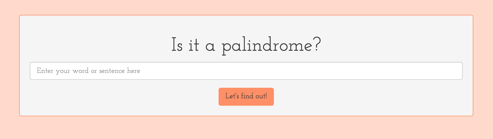

# _Palindrome_

### _Checks to see if a word is a palindrome, August 16, 2016_

#### _**By Aimen Khakwani and Molly LeCompte**_

## Description

_Takes user input and uses JavaScript to confirm if it is a palindrome._

####

##Setup and Installation

* _Clone from GitHub_
* _Run in browser_

## Technologies Used

_HTML, CSS, Bootstrap, jQuery, and JavaScript_

### License
Copyright (c) 2016 **_Aimen Khakwani & Molly LeCompte**
